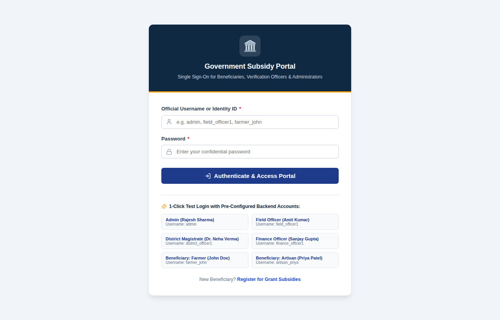

# Government Subsidy & Grant Disbursement Tracking System

A full-stack web application that manages the complete lifecycle of a government subsidy: from a citizen applying for a scheme, through automated eligibility scoring and a three-level verification chain (field → district → finance), to staged fund release via a simulated Direct Benefit Transfer (DBT) gateway and final verification of how the money was spent.

Built with **Java 21 / Spring Boot 3** on the backend and **React 18 / Vite** on the frontend. Authentication is stateless JWT with five role types, and every important action is written to an audit trail.

> **Demo project.** The UI is styled like a government portal for realism, but this is a learning / portfolio project, not an official government website. Treasury and identity integrations are simulated, and no real personal or financial data is used.



<!-- Add more screenshots of your running app in docs/screenshots/ and link them here, e.g.
 -->

---

## Table of contents

1. [Features](#features)
2. [Tech stack](#tech-stack)
3. [Architecture](#architecture)
4. [Application workflow](#application-workflow)
5. [Roles & permissions](#roles--permissions)
6. [Getting started](#getting-started)
7. [Demo accounts](#demo-accounts)
8. [REST API reference](#rest-api-reference)
9. [Frontend pages](#frontend-pages)
10. [Database](#database)
11. [Testing](#testing)
12. [Project structure](#project-structure)
13. [Configuration reference](#configuration-reference)
14. [Security notes & known limitations](#security-notes--known-limitations)
15. [Roadmap](#roadmap)

---

## Features

**For beneficiaries (applicants)**
- Register an account and complete a beneficiary profile (identity number, category, income, land holding, bank details, region).
- Browse active schemes with their eligibility criteria and grant limits; apply with one form.
- Track every application on an 11-stage progress stepper, see the verification history and the disbursement schedule.
- Attach supporting documents and submit fund-utilization proofs after receiving money.

**For officers**
- **Field officer** – ground verification queue; approve, reject, or request re-verification; mark milestone compliance.
- **District officer** – district-level review queue, overdue-milestone monitoring, regional reports.
- **Finance officer** – final financial sanction (can approve a lower amount than requested), create staged disbursement plans, release funds through the simulated Treasury gateway (returns a UTR), monitor expenditure.

**For administrators**
- Executive dashboard with KPIs, scheme-wise budget charts and category distribution.
- Scheme master with configurable, weighted eligibility criteria; regional jurisdictions with budgets.
- Beneficiary directory with KYC status updates, CSV report exports, full audit-trail viewer, integrations console.

**Platform**
- Configurable **eligibility scoring engine** (income, age, category, land holding, region, disability) with mandatory and weighted criteria.
- **Risk classification**: `HIGH_VALUE` for requests of ₹5,00,000 or more, `FLAGGED` for borderline scores, otherwise `LOW`.
- **Compliance enforcement**: money for a milestone cannot be released until its compliance condition has been inspected and satisfied.
- **Utilization tracking**: verified spending is compared with released funds; an application becomes `COMPLETED` at 100 % verified utilization.
- **Schedulers** that flag overdue milestones (hourly) and fully-disbursed grants with no utilization for 60+ days.
- **Audit log** of logins, registrations, status transitions and financial actions.

---

## Tech stack

| Layer | Technology |
| :--- | :--- |
| Backend | Java 21, Spring Boot 3.2.5, Spring Web, Spring Data JPA (Hibernate), Spring Security, Bean Validation, Actuator |
| Auth | JWT (JJWT 0.12.5), BCrypt password hashing, method-level `@PreAuthorize` + URL rules |
| Database | MySQL 8 (production/dev), H2 in-memory (tests) |
| Frontend | React 18, Vite 5, React Router 6, Axios, Lucide icons, hand-written CSS (no UI framework) |
| Build | Maven (backend), npm (frontend) |

---

## Architecture

```
┌────────────────────┐    HTTPS/JSON + Bearer JWT    ┌───────────────────────────────┐    JDBC    ┌──────────┐
│  React SPA (Vite)  │ ────────────────────────────▶ │  Spring Boot REST API (:8080) │ ─────────▶ │ MySQL 8  │
│  localhost:3000    │ ◀──────────────────────────── │  controller → service → repo  │            └──────────┘
└────────────────────┘        ApiResponse<T>         └───────────────────────────────┘
```

**Backend layers** (`com.example.governmentsubsidy`)

| Package | Responsibility |
| :--- | :--- |
| `controller` | REST endpoints, request validation, role annotations |
| `service` | Business rules: eligibility, verification workflow, disbursement, utilization, analytics, audit |
| `repository` | Spring Data JPA repositories |
| `entity`, `enums` | JPA model (15 tables) and domain enums |
| `dto` | Request/response objects; every response is wrapped in `ApiResponse<T>` (`success`, `message`, `data`, `timestamp`) |
| `security` | JWT service, authentication filter, `SecurityConfig` (stateless, CORS, URL rules) |
| `exception` | `GlobalExceptionHandler` mapping domain exceptions to consistent JSON errors (`status`, `message`, `details[]`) |
| `scheduler` | Compliance monitoring jobs |
| `config` | `DataInitializer` – seeds roles, demo users, regions, schemes and one sample application on an empty database |

**Frontend structure** (`frontend/src`): `pages/` (per role), `components/` (layout, tables, charts, workflow stepper), `services/` (one Axios wrapper per backend controller), `context/` (auth + toast), `routes/` (protected routes with role checks), `constants/` (roles, statuses, navigation).

---

## Application workflow

```
DRAFT ─▶ SUBMITTED ─▶ FIELD_VERIFICATION ─▶ DISTRICT_REVIEW ─▶ FINANCE_APPROVAL ─▶ DISBURSEMENT_PLANNED
                │              │                   │                  │
                │              └─ REVERIFICATION_REQUIRED ◀──────────┘ (field / district can send back)
                └─ REJECTED  ◀── rejection is possible at eligibility, field, district and finance stages

DISBURSEMENT_PLANNED ─▶ MILESTONE_PENDING ─▶ DISBURSEMENT_IN_PROGRESS ─▶ FULLY_DISBURSED
                                                                              │
                                              UTILIZATION_PENDING ◀───────────┘ (first utilization submitted)
                                                        │
                                                        ▼
                                                    COMPLETED   (100 % of released funds verified as utilized)
```

1. **Apply** – a beneficiary creates and submits an application for a scheme (amount must be within the scheme's min/max grant).
2. **Eligibility scoring** – running the evaluation scores the applicant against the scheme's criteria. Passing moves the application to `FIELD_VERIFICATION`; failing mandatory criteria or the minimum score rejects it. The risk level is assigned here.
3. **Field → District → Finance** – each stage records an `APPROVED`, `REJECTED` or `REVERIFICATION_REQUESTED` decision with remarks (finance supports approve/reject only). Finance sets the final approved amount, which can be lower than requested but never above the scheme maximum.
4. **Disbursement plan** – finance splits the approved amount into milestones (the milestone amounts must add up exactly).
5. **Compliance & release** – an officer marks a milestone's compliance condition as satisfied; finance then releases the funds. The simulated Treasury gateway returns a UTR reference.
6. **Utilization** – the beneficiary submits proof of spending (cannot exceed released funds); an officer verifies it. Once 100 % is verified the application completes.

Every transition is validated by a state machine; an illegal transition (for example finance approval on an application still in field verification) is rejected with a `400` error.

---

## Roles & permissions

| Capability | Beneficiary | Field officer | District officer | Finance officer | Admin |
| :--- | :---: | :---: | :---: | :---: | :---: |
| Browse schemes / regions (public) | ✅ | ✅ | ✅ | ✅ | ✅ |
| Create / submit applications, attach documents | ✅ | | | | ✅ |
| Field verification | | ✅ | | | ✅ |
| District review | | | ✅ | | ✅ |
| Finance approval | | | | ✅ | ✅ |
| Create plans, release funds | | | | ✅ | ✅ |
| Mark milestone compliance / verify utilization | | ✅ | ✅ | ✅ | ✅ |
| View all applications, beneficiary directory | | ✅ | ✅ | ✅ | ✅ |
| Overdue milestones | | ✅ | ✅ | ✅ | ✅ |
| Analytics dashboard | | ✅ | ✅ | ✅ | ✅ |
| CSV reports | | | ✅ | ✅ | ✅ |
| Treasury / identity integration console | | | | ✅ | ✅ |
| Create schemes & regions, audit logs | | | | | ✅ |

Self-registration (`POST /api/auth/register`) only ever creates **beneficiary** accounts. Officer and admin accounts come from the seed data or are provisioned by an administrator.

---

## Getting started

### Prerequisites

- **JDK 21**
- **Maven 3.9+**
- **MySQL 8** (local install, or use the included `docker-compose.yml`)
- **Node.js 18+** and npm

### 1. Clone

```bash
git clone https://github.com/<your-username>/government-subsidy-system.git
cd government-subsidy-system
```

### 2. Start MySQL

Either use a local MySQL server, or the bundled helper:

```bash
cp .env.example .env          # Windows: copy .env.example .env
# edit .env and set DB_PASSWORD (and JWT_SECRET)
docker compose up -d
```

The database `subsidy_db` is created automatically (`createDatabaseIfNotExist=true`), and Hibernate creates the tables on first start. `backend/src/main/resources/schema-mysql.sql` is provided as a reference for the schema.

### 3. Configure and run the backend

The backend reads its secrets from **environment variables** – nothing sensitive is stored in the repository.

| Variable | Required | Default | Purpose |
| :--- | :---: | :--- | :--- |
| `JWT_SECRET` | ✅ | – | Signing key for tokens, **at least 32 characters** |
| `DB_PASSWORD` | usually | *(empty)* | MySQL password |
| `DB_USERNAME` | | `root` | MySQL user |
| `DB_URL` | | `jdbc:mysql://localhost:3306/subsidy_db?...` | Full JDBC URL override |

**Linux / macOS**

```bash
cd backend
export DB_PASSWORD='your-mysql-password'
export JWT_SECRET="$(openssl rand -hex 32)"
mvn spring-boot:run
```

**Windows PowerShell**

```powershell
cd backend
$env:DB_PASSWORD = "your-mysql-password"
$env:JWT_SECRET  = -join ((48..57)+(97..122) | Get-Random -Count 48 | ForEach-Object {[char]$_})
mvn spring-boot:run
```

**IDE (IntelliJ / VS Code):** add the same variables to the run configuration (VS Code: `envFile` in `launch.json`, pointing at a git-ignored `.env`).

The API is now on **http://localhost:8080**. On the first start against an empty database the seed data (roles, demo users, regions, two schemes, one sample application) is created automatically.

> Note: `JWT_SECRET` should stay the same between restarts; a new secret invalidates existing sessions.

### 4. Run the frontend

```bash
cd frontend
cp .env.example .env          # Windows: copy .env.example .env
npm install
npm run dev
```

Open **http://localhost:3000** and sign in with one of the [demo accounts](#demo-accounts).

Production build: `npm run build` (output in `frontend/dist`, preview with `npm run preview`).

### Frontend environment

| Variable | Default | Purpose |
| :--- | :--- | :--- |
| `VITE_API_BASE_URL` | `http://localhost:8080` | Backend base URL |
| `VITE_ENABLE_DEMO_LOGIN` | `true` | Shows the one-click demo login and the role switcher. Set to `false` for any public deployment – the demo credentials are then removed from the bundle |

---

## Demo accounts

Created by `DataInitializer` on an empty database. **For local demos only – change or remove them before any real deployment.**

| Role | Username | Password |
| :--- | :--- | :--- |
| Admin | `admin` | `Admin@123` |
| Field officer | `field_officer1` | `Officer@123` |
| District officer | `district_officer1` | `District@123` |
| Finance officer | `finance_officer1` | `Finance@123` |
| Beneficiary (farmer) | `farmer_john` | `User@123` |
| Beneficiary (artisan) | `artisan_priya` | `User@123` |

**Suggested walkthrough** (about 5 minutes):

1. Sign in as `farmer_john` → *Available Schemes* → apply for a grant → on the tracking page click *Run Automated Eligibility Scoring*.
2. Switch to `field_officer1` → *Field Verification Queue* → approve.
3. Switch to `district_officer1` → *District Review Queue* → approve.
4. Switch to `finance_officer1` → *Finance Sanction Queue* → approve (optionally with a lower amount) → *Disbursement Plans & DBT* → create a milestone plan.
5. As a field officer mark a milestone's compliance as satisfied; as finance officer release the funds and note the UTR.
6. Back as `farmer_john` submit a utilization; verify it as an officer and watch the application reach `COMPLETED`.
7. Sign in as `admin` to see the dashboard, reports and audit trail.

A sample application already waiting in `FIELD_VERIFICATION` is seeded so step 2 can be tried immediately.

---

## REST API reference

Base URL `http://localhost:8080`. All responses use the envelope
`{ "success": true, "message": "...", "data": ..., "timestamp": "..." }`; errors return
`{ "timestamp", "status", "error", "message", "path", "details": [] }`.
Send the token as `Authorization: Bearer <jwt>`.

"Auth" = any authenticated user.

| Area | Method & path | Access |
| :--- | :--- | :--- |
| **Auth** | `POST /api/auth/register` | Public (beneficiary accounts only) |
| | `POST /api/auth/login` | Public |
| | `GET /api/auth/me` | Auth |
| **Schemes** | `GET /api/schemes`, `/api/schemes/active`, `/api/schemes/{id}` | Public |
| | `POST /api/schemes`, `PUT /api/schemes/{id}` | Admin |
| **Regions** | `GET /api/regions`, `/api/regions/{id}` | Public |
| | `POST /api/regions` | Admin |
| **Beneficiaries** | `POST /api/beneficiaries`, `GET /api/beneficiaries/me` | Auth |
| | `GET /api/beneficiaries`, `GET /api/beneficiaries/{id}` | Admin, Field, District, Finance |
| | `PATCH /api/beneficiaries/{id}/kyc?status=` | Admin, Field, District |
| **Applications** | `POST /api/applications`, `POST /api/applications/{id}/submit`, `POST /api/applications/{id}/documents` | Beneficiary, Admin |
| | `POST /api/applications/{id}/evaluate-eligibility` | Auth |
| | `GET /api/applications/my`, `GET /api/applications/{id}` | Auth |
| | `GET /api/applications?status=` | Admin, Field, District, Finance |
| **Verifications** | `POST /api/verifications/field/{applicationId}` | Field, Admin |
| | `POST /api/verifications/district/{applicationId}` | District, Admin |
| | `POST /api/verifications/finance/{applicationId}?approvedAmount=` | Finance, Admin |
| | `GET /api/verifications/application/{applicationId}` | Auth |
| **Disbursements** | `POST /api/disbursements/plan` | Finance, Admin |
| | `POST /api/disbursements/milestones/{milestoneId}/release` | Finance, Admin |
| | `GET /api/disbursements/application/{applicationId}` | Auth |
| **Milestones** | `GET /api/milestones/{id}`, `/api/milestones/application/{applicationId}` | Auth |
| | `POST /api/milestones/{id}/complete` | Field, District, Finance, Admin |
| | `GET /api/milestones/overdue` | Field, District, Finance, Admin |
| **Utilizations** | `POST` / `GET /api/utilizations/application/{applicationId}` | Auth |
| | `POST /api/utilizations/{id}/verify?approved=&remarks=` | Field, District, Finance, Admin |
| **Analytics** | `GET /api/analytics/dashboard`, `/schemes`, `/regions` | Admin, Finance, District, Field |
| **Reports (CSV)** | `GET /api/reports/{schemes\|regions\|disbursements\|milestones\|utilizations}/csv` | Admin, Finance, District |
| **Audit** | `GET /api/audit-logs`, `/entity/{name}/{id}`, `/user/{username}` | Admin |
| **Integrations (simulated)** | `POST /api/integrations/treasury/test-transfer`, `GET /api/integrations/beneficiary/verify-identity` | Admin, Finance |

Quick check with curl:

```bash
TOKEN=$(curl -s -X POST localhost:8080/api/auth/login \
  -H 'Content-Type: application/json' \
  -d '{"username":"admin","password":"Admin@123"}' | jq -r .data.token)

curl -s localhost:8080/api/analytics/dashboard -H "Authorization: Bearer $TOKEN" | jq .
```

---

## Frontend pages

| Route | Who | Purpose |
| :--- | :--- | :--- |
| `/login`, `/register` | Public | Sign in / create a beneficiary account |
| `/beneficiary/dashboard` | Beneficiary, Admin | Overview of profile and applications |
| `/beneficiary/schemes` (`/:id`) | Signed-in users | Scheme catalogue and application form |
| `/beneficiary/applications` | Beneficiary, Admin | My applications |
| `/beneficiary/applications/:id` | Signed-in users | Tracking page: stepper, verifications, milestones, utilization |
| `/beneficiary/profile` | Beneficiary, Admin | Identity, income, bank and region details |
| `/officer/dashboard` | Officers, Admin | Role-aware queue overview |
| `/officer/field-verification` | Field, Admin | Field inspection queue |
| `/officer/district-review` | District, Admin | District review queue |
| `/officer/finance-approval` | Finance, Admin | Financial sanction queue |
| `/officer/disbursements` | Finance, Admin | Create plans and release funds |
| `/officer/milestones` | Officers, Admin | Milestone compliance / overdue list |
| `/officer/utilizations` | Officers, Admin | Verify expenditure proofs |
| `/admin/dashboard` | Admin | Executive analytics |
| `/admin/schemes`, `/admin/regions` | Admin | Master data |
| `/admin/beneficiaries` | Officers, Admin | Beneficiary directory & KYC |
| `/admin/reports` | Admin, Finance, District | CSV exports |
| `/admin/audit` | Admin | Audit trail |
| `/admin/integrations` | Admin, Finance | Treasury and identity simulators |

Route guards in the frontend are a convenience only – the backend enforces every permission independently.

---

## Database

15 tables (see `backend/src/main/resources/schema-mysql.sql`): `users`, `roles`, `user_roles`, `regions`, `beneficiaries`, `schemes`, `eligibility_criteria`, `subsidy_applications`, `application_documents`, `verifications`, `disbursement_plans`, `disbursement_milestones`, `fund_releases`, `fund_utilizations`, `audit_logs`.

Hibernate is configured with `ddl-auto=update`, which is convenient for development; use migrations (Flyway/Liquibase) for a real deployment.

---

## Testing

```bash
cd backend
mvn test
```

The backend has 20 JUnit tests across six classes covering authentication, eligibility scoring and risk classification, the workflow state machine, staged disbursement with compliance enforcement, and fund utilization. They run against an in-memory H2 database using the `test` profile (`src/test/resources/application-test.properties`), so MySQL is not needed.

The frontend has no automated tests yet; `npm run build` verifies that it compiles.

---

## Project structure

```
government-subsidy-system/
├── backend/                       Spring Boot application
│   ├── pom.xml
│   └── src/
│       ├── main/java/com/example/governmentsubsidy/
│       │   ├── config/  controller/  dto/  entity/  enums/
│       │   ├── exception/  repository/  scheduler/  security/  service/
│       ├── main/resources/        application.properties, schema-mysql.sql
│       └── test/                  JUnit tests + H2 test profile
├── frontend/                      React + Vite SPA
│   ├── package.json  vite.config.js  .env.example
│   └── src/
│       ├── components/  constants/  context/  pages/
│       ├── routes/  services/  utils/
├── docs/screenshots/
├── docker-compose.yml             optional local MySQL
├── .env.example                   template for backend environment variables
└── README.md
```

---

## Configuration reference

`backend/src/main/resources/application.properties`

| Property | Default | Notes |
| :--- | :--- | :--- |
| `server.port` | `8080` | |
| `spring.datasource.*` | from `DB_URL`, `DB_USERNAME`, `DB_PASSWORD` | |
| `app.jwt.secret` | from `JWT_SECRET` | required, ≥ 32 characters |
| `app.jwt.expiration-ms` | `86400000` (24 h) | token lifetime |
| `app.scheduling.enabled` | `true` | disable the compliance jobs (tests do) |
| `app.scheduler.milestone-check` | `0 0 * * * ?` | cron: hourly overdue-milestone check |
| `app.scheduler.utilization-check` | `0 30 * * * ?` | cron: hourly utilization check |
| `spring.jpa.hibernate.ddl-auto` | `update` | |

---

## Security notes & known limitations

This project demonstrates the patterns (JWT, RBAC, layered validation, audit logging) but is not production-hardened. Known gaps, in rough priority order:

- **No object-level authorization.** Role checks are enforced, but any signed-in user who knows an application ID can read it. Ownership checks (beneficiary → own applications only; officers → own region) should be added in the service layer.
- **Documents are metadata only.** The "attach document" and "utilization proof" features store a file name/path; there is no real file upload or storage yet.
- **Simulated integrations.** Treasury/DBT and identity verification are mock services that generate reference numbers locally.
- **JWT kept in `localStorage`** and no refresh-token / revocation flow. An `HttpOnly` cookie or short-lived access + refresh tokens would be safer.
- **CORS allows any origin** (`*`, with credentials) for easy local development. Restrict it to your frontend origin before deploying.
- **Seeded demo passwords** are public in this README – disable seeding (or change the credentials) and set `VITE_ENABLE_DEMO_LOGIN=false` for any shared environment.
- `ddl-auto=update` instead of versioned migrations; no pagination on list endpoints; no rate limiting on login.

---

## Roadmap

- [ ] Ownership / jurisdiction-based access checks
- [ ] Real document upload (multipart) with storage and virus scanning hook
- [ ] Flyway migrations and a Dockerfile / full docker-compose stack
- [ ] Pagination and server-side filtering for large queues
- [ ] Frontend tests (Vitest + React Testing Library) and a CI workflow
- [ ] OpenAPI / Swagger documentation
- [ ] Notifications (email / SMS) on status changes

---

## Contributing

Issues and pull requests are welcome. Please open an issue first to discuss larger changes.

## Authors

Built as a Intership project. <!-- add your name, teammates and profile links here -->
